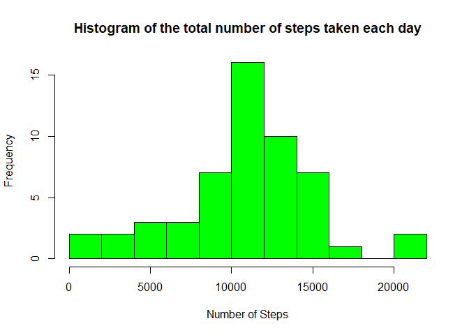
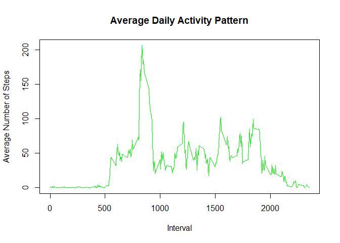
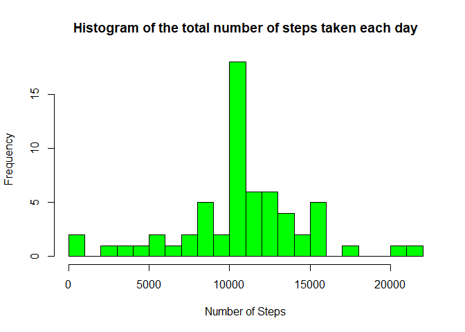
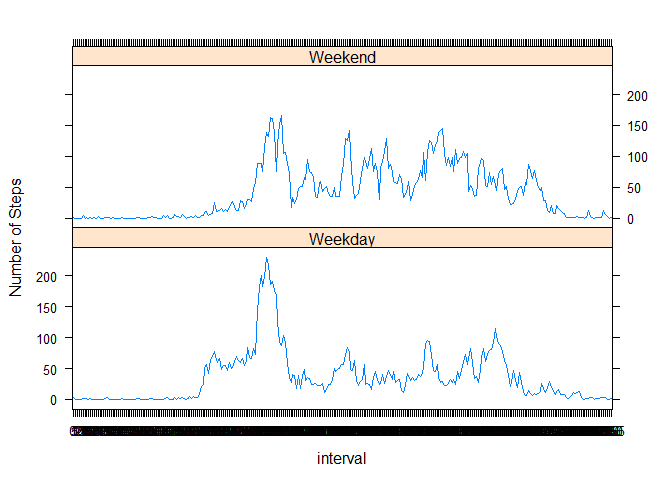

*  Load the Data

```r
data <- read.csv("activity.csv", header = TRUE, sep = ",", na.strings = "NA")
```
*  Process/transform the data (if necessary) into a format suitable for your analysis

```r
data$date <- as.Date(data$date, format = "%Y-%m-%d")
data$interval <- factor(data$interval)
```
*  What is mean total number of steps taken per day?

* Missing values

```r
indexes <- is.na(as.character(data$steps))
data_no_NA <- data[!indexes,]
head(data_no_NA)
```

```
##     steps       date interval
## 289     0 2012-10-02        0
## 290     0 2012-10-02        5
## 291     0 2012-10-02       10
## 292     0 2012-10-02       15
## 293     0 2012-10-02       20
## 294     0 2012-10-02       25
```
*  Adding steps 

```r
tstepsd <- aggregate(steps ~ date, data = data_no_NA, sum)
colnames(tstepsd) <- c("date", "steps")
```
* Histogram 

```r
hist(as.numeric(tstepsd$steps), breaks = 10, col = "green", xlab = "Number of Steps", main= "Histogram of the total number of steps taken each day")
```

<!-- -->
*  Report the mean and median

```r
mean(tstepsd$steps)
```

```
## [1] 10766.19
```

```r
median(tstepsd$steps)
```

```
## [1] 10765
```


*  What is the average daily activity pattern?
*  Doing the average and ploting Calculating the average

```r
stepspi <- aggregate(data_no_NA$steps, by=list(interval=data_no_NA$interval), FUN=mean)
colnames(stepspi) <- c("interval", "average_steps")
plot(as.integer(levels(stepspi$interval)), stepspi$average_steps, type="l",
     xlab = "Interval", ylab = "Average Number of Steps", main = "Average Daily Activity Pattern",  col ="green")
```

<!-- -->
* Calculing the maximum number of steps

```r
max_steps <- max(stepspi$average_steps)
max_steps
```

```
## [1] 206.1698
```
* Maximum number of steps with intervals

```r
intervale_max_steps<-stepspi[which.max(stepspi$average_steps),]$interval
intervale_max_steps
```

```
## [1] 835
## 288 Levels: 0 5 10 15 20 25 30 35 40 45 50 55 100 105 110 115 120 125 ... 2355
```
*  Imputing missing values
*  Calculate and report the total number of missing values in the dataset (i.e. the total number of rows with \color{red}{\verb|NA|}NAs)

```r
sum(is.na(as.character(data$steps)))
```

```
## [1] 2304
```

```r
sum(is.na(as.character(data$date)))
```

```
## [1] 0
```

```r
sum(is.na(as.character(data$interval)))
```

```
## [1] 0
```
* Devise a strategy for filling in all of the missing values in the dataset. The strategy does not need to be sophisticated. For example, you could use the mean/median for that day, or the mean for that 5-minute interval, etc


```r
indexes <- which(is.na(as.character(data$steps)))
complete_data <- data
complete_data[indexes, ]$steps<-unlist(lapply(indexes, FUN=function(indexes){stepspi[data[indexes,]$interval==stepspi$interval,]$average_steps}))
```
*  Create a new dataset that is equal to the original dataset but with the missing data filled in.

```r
summary(complete_data)
```

```
##      steps             date               interval    
##  Min.   :  0.00   Min.   :2012-10-01   0      :   61  
##  1st Qu.:  0.00   1st Qu.:2012-10-16   5      :   61  
##  Median :  0.00   Median :2012-10-31   10     :   61  
##  Mean   : 37.38   Mean   :2012-10-31   15     :   61  
##  3rd Qu.: 27.00   3rd Qu.:2012-11-15   20     :   61  
##  Max.   :806.00   Max.   :2012-11-30   25     :   61  
##                                        (Other):17202
```

```r
str(complete_data)
```

```
## 'data.frame':	17568 obs. of  3 variables:
##  $ steps   : num  1.717 0.3396 0.1321 0.1509 0.0755 ...
##  $ date    : Date, format: "2012-10-01" "2012-10-01" ...
##  $ interval: Factor w/ 288 levels "0","5","10","15",..: 1 2 3 4 5 6 7 8 9 10 ...
```
*  Make a histogram of the total number of steps taken each day and Calculate and report the mean and median total number of steps taken per day

```r
tstepsd_complete <- aggregate(steps ~ date, data = complete_data, sum)
colnames(tstepsd_complete) <- c("date", "steps")
hist(as.numeric(tstepsd_complete$steps), breaks = 20, col = "green", xlab = "Number of Steps", main= "Histogram of the total number of steps taken each day")
```

<!-- -->


```r
mean(tstepsd_complete$steps)
```

```
## [1] 10766.19
```

```r
median(tstepsd_complete$steps)
```

```
## [1] 10766.19
```
*  Are there differences in activity patterns between weekdays and weekends?
* Create a new factor variable in the dataset with two levels – “weekday” and “weekend” indicating whether a given date is a weekday or weekend day.

```r
complete_data$day <- as.factor(weekdays(complete_data$date))
complete_data$is_weekday <- ifelse(!(complete_data$day %in% c("Saturday","Sunday")), TRUE, FALSE)
weekdays_data <- complete_data[complete_data$is_weekday,]
stepspi_weekdays <- aggregate(weekdays_data$steps, by=list(interval=weekdays_data$interval), FUN=mean)

weekends_data <- complete_data[!complete_data$is_weekday,]
stepspi_weekends <- aggregate(weekends_data$steps, by=list(interval=weekends_data$interval), FUN=mean)

colnames(stepspi_weekdays) <- c("interval", "average_steps")
colnames(stepspi_weekends) <- c("interval", "average_steps")

stepspi_weekdays$day <- "Weekday"
stepspi_weekends$day <- "Weekend"

week_data <- rbind(stepspi_weekends, stepspi_weekdays)

week_data$day <- as.factor(week_data$day)
```
*  Make a panel plot containing a time series plot (i.e. \color{red}{\verb|type = "l"|}type="l") of the 5-minute interval (x-axis) and the average number of steps taken, averaged across all weekday days or weekend days (y-axis)


```r
library(lattice)
xyplot(average_steps ~  interval | day, data = week_data, layout = c(1,2), type ="l", ylab="Number of Steps")
```

<!-- -->
